# Little Lemon Meta Capstone Project

## Overview

This repository contains the final project for the Meta Back-End Developer Specialization Capstone course on Coursera, centered around building a robust web API for the Little Lemon restaurant. The project showcases a full-stack back-end application using Django and Django REST Framework, connected to a MySQL database. It includes features like table booking, menu management, user authentication, and API testing, demonstrating a wide range of skills acquired throughout the specialization. The application serves static HTML content and implements secure APIs.

## Technologies Used

- **Framework**: Django, Django REST Framework (DRF)
- **Database**: MySQL
- **Authentication**: Djoser (token-based)
- **Testing**: Unit tests, Insomnia
- **Version Control**: Git, GitHub
- **Tools**: VS Code, pipenv

## Project Structure

```
.
├── littlelemon/             # Project directory
│   ├── __init__.py
│   ├── asgi.py
│   ├── settings.py          # MySQL and app configurations
│   ├── urls.py              # Project-level URL configurations
│   └── wsgi.py
├── restaurant/              # App directory
│   ├── __init__.py
│   ├── admin.py             # Model registrations
│   ├── apps.py
│   ├── migrations/          # Migration files
│   ├── models.py            # Menu and Booking models
│   ├── serializers.py       # DRF serializers
│   ├── templates/           # HTML templates
│   │   ├── restaurant/
│   │   │   ├── index.html     # Homepage with static content
│   ├── tests/               # Unit tests
│   │   ├── test_models.py
│   │   ├── test_views.py
│   ├── urls.py              # App-level URL configurations
│   └── views.py             # API views
├── manage.py                # Django management script
├── Pipfile                  # Pipenv dependency file
├── Pipfile.lock
├── static/                  # Static assets (images, CSS, JS)
│   ├── restaurant/
│   │   └── littlelemon.png
└── screenshots/             # Demo screenshots
    ├── 1-Littlelemon-homepage.PNG
    ├── 2-database-LittleLemon-tables.PNG
    ├── 3-data-in-booking.PNG
    ├── 4-data-in-menu.PNG
    ├── 5-fetch-list-of-menuitems.PNG
    ├── 6-booking-tables.PNG
    ├── 7-generate-and-obtain-token.PNG
    ├── 8-api-token-auth-from-the-Insomnia-client.PNG
    ├── 9-response-from-a-secured-URL.PNG
    ├── 10-tests-ran-successfully.PNG
    ├── 11-GET-request-to-list-menu-items.PNG
    ├── 12-add-menu-item-through-the-Insomnia-interface.PNG
    ├── 13-update-an-existing-item-data.PNG
    ├── 14-delete-an-item.PNG
```

## Setup and Usage Guide

Follow these steps to set up and use the Little Lemon Capstone project on your local machine.

### 1. Prerequisites
- Install Python 3.8+ and pip.
- Install MySQL Server (download from https://www.mysql.com/downloads/) and ensure it runs on port 3306.
- Install VS Code and the MySQL extension.

### 2. Clone the Repository
Download the project to your local machine:
```bash
git clone https://github.com/HossamJa/LittleLemon-Meta-Capstone-Project.git
cd LittleLemon-Meta-Capstone-Project
```

### 3. Set Up the Virtual Environment
Activate the pipenv virtual environment:
```bash
pipenv shell
```

### 4. Install Dependencies
Install required packages:
```bash
pipenv install
pipenv install mysqlclient
```

### 5. Configure MySQL
- Start MySQL and log in with `mysql -u root -p` (default password: `password` or blank).
- Create the database:
  ```sql
  CREATE DATABASE LittleLemon;
  SHOW DATABASES;
  ```
- Update `settings.py` with the MySQL configuration (database: `LittleLemon`, user: `root`, password: as set).

### 6. Apply Migrations
Set up the database schema:
```bash
python manage.py makemigrations
python manage.py migrate
```

### 7. Run the Server
Start the Django development server:
```bash
python manage.py runserver
```
Access the application at http://127.0.0.1:8000/.

### 8. API Paths for Peer Review:
- **Home Page**: Visit http://127.0.0.1:8000/restaurant/ to see static content.
- **API Testing**: Use Insomnia to test endpoints:
  - **Menu API**: http://127.0.0.1:8000/restaurant/menu/ (GET, POST, PUT, DELETE)
  - **Booking API**: http://127.0.0.1:8000/restaurant/booking/tables/ (GET, POST, PUT, DELETE)
  - **User Registration**: http://127.0.0.1:8000/auth/users/ (POST)
  - **Token Login**: http://127.0.0.1:8000/auth/token/login/ (POST)
  - **Logout**: http://127.0.0.1:8000/auth/token/logout/ (POST)
- **Authentication**: Obtain a token via login and include it in the `Authorization: Token <token>` header for secured endpoints.

## Features Implemented

### Module 1: Starting the Project
- Set up a Django project (`littlelemon`) and app (`restaurant`).
- Created a GitHub repository and committed the initial project.
- Configured static routes to serve the homepage with an image.
  - **LittleLemon Homepage**: 
    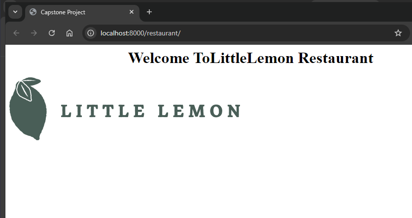

### Module 2: Project Functionality
- Connected the back-end to a MySQL database.
  - **Database Tables**:
  
    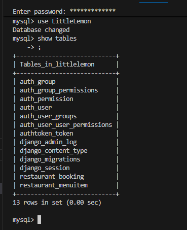

- Defined `Menu` and `Booking` models and migrated them.
  - **Booking Data**: 
    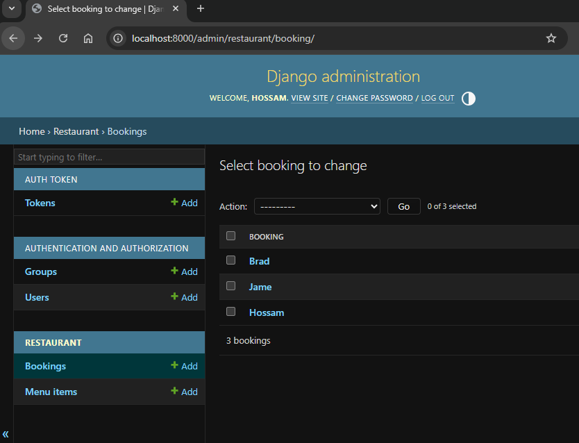

  - **Booking Data**: 
    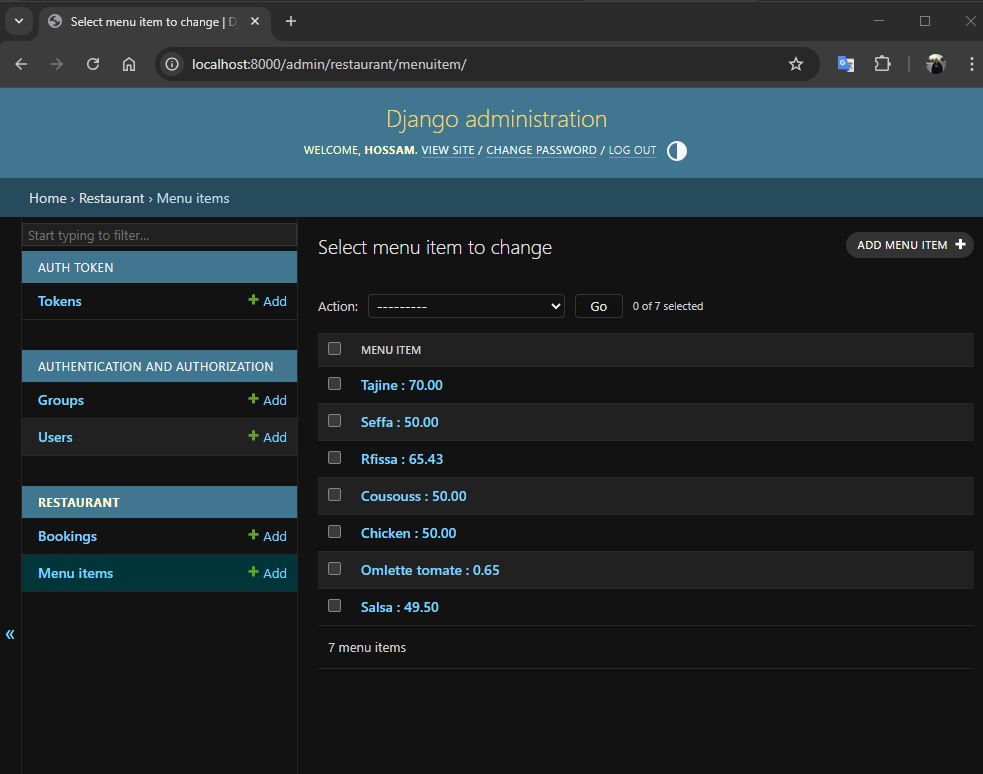

- Implemented the Menu API with CRUD operations.
  - **Fetch Menu Items**: 
    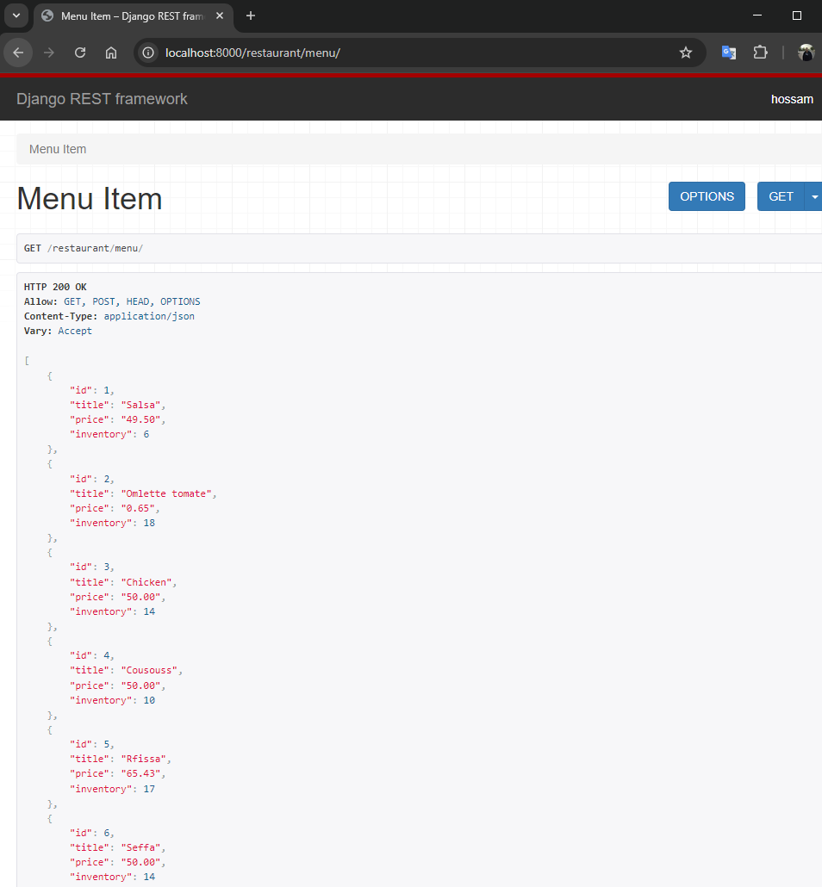

- Built the Table Booking API using DRF ModelViewSet.
  - **Booking Tables**: 
    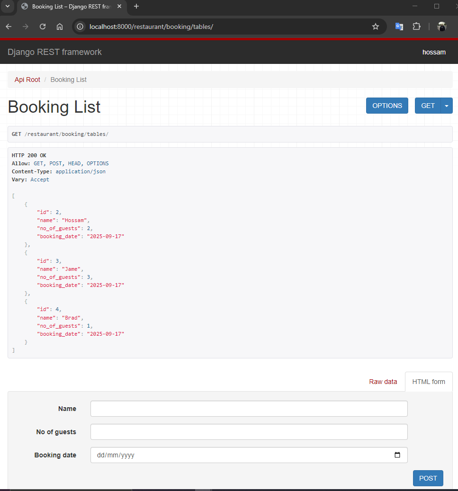

### Module 3: Security and Testing
- Added user registration, login, and logout using Djoser.
  - **Generate Token**: 
    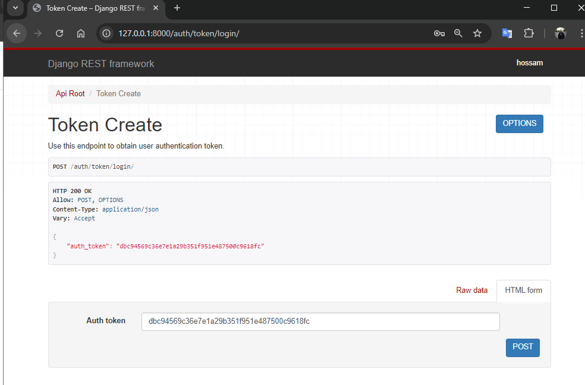

- Secured the Table Booking API with token authentication.
  - **Token Auth**: 
    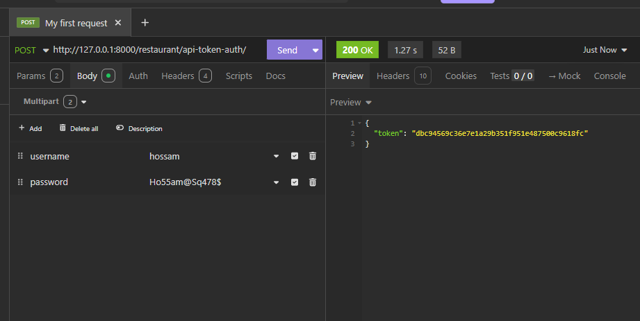
  
  - **Secured Response**: 
    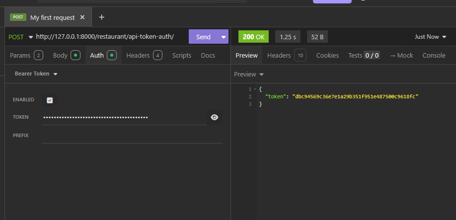

- Wrote unit tests for models and views.
  - **Tests Ran Successfully**: 
    

- Tested APIs with Insomnia (GET, POST, PUT, DELETE).
  - **GET Request**:
    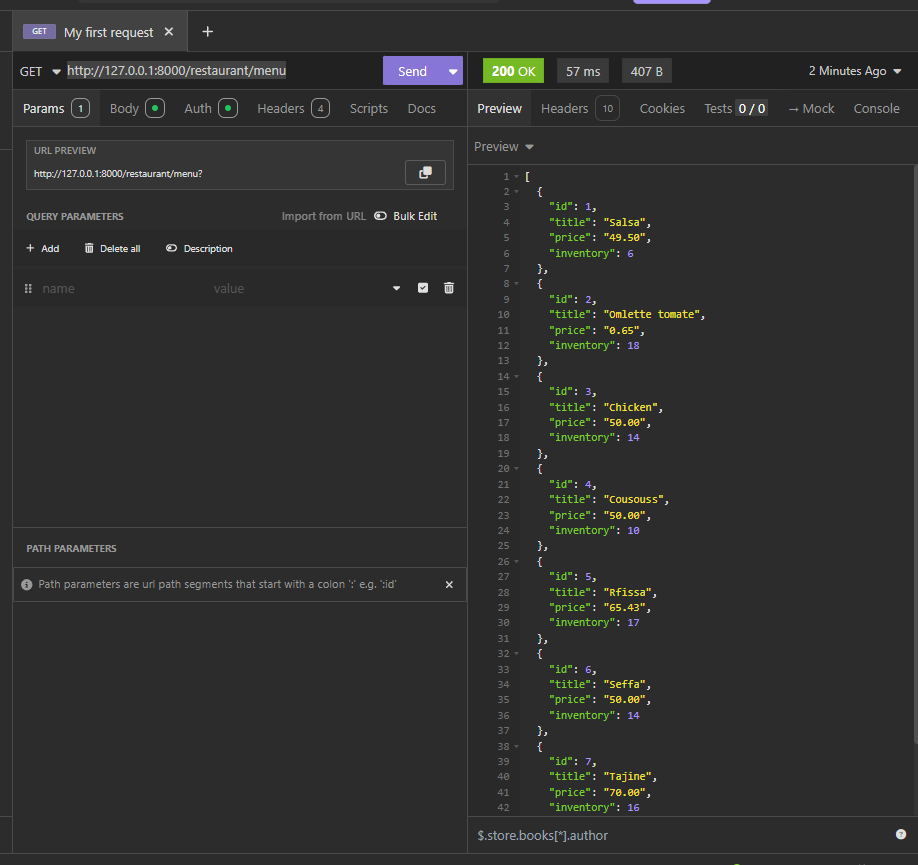

  - **Add Item**:
    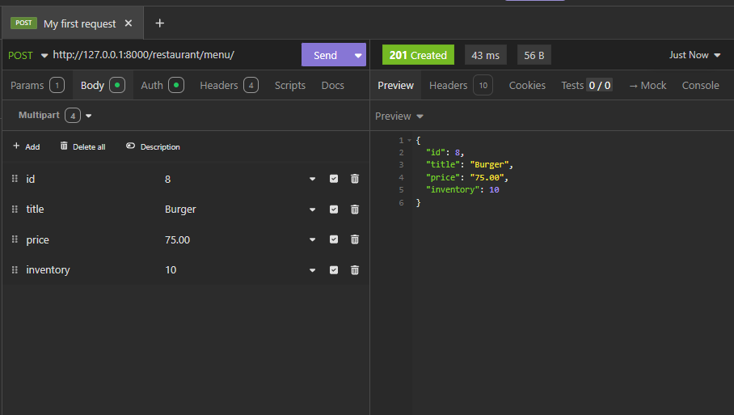

  - **Update Item**:
    

  - **Delete Item**:
    

### Module 4: Graded Assessment
- Completed a self-review and prepared for peer review.
- Reflected on skills synthesis and future learning paths.

## General Notes
- Ensure MySQL is running and credentials match `settings.py`.
- Test all APIs with Insomnia, verifying authentication and CRUD operations.
- The project is designed as a portfolio piece, highlighting back-end development proficiency.

## License
This project is based on Meta course materials for educational purposes. See the [LICENSE](LICENSE) file for details.